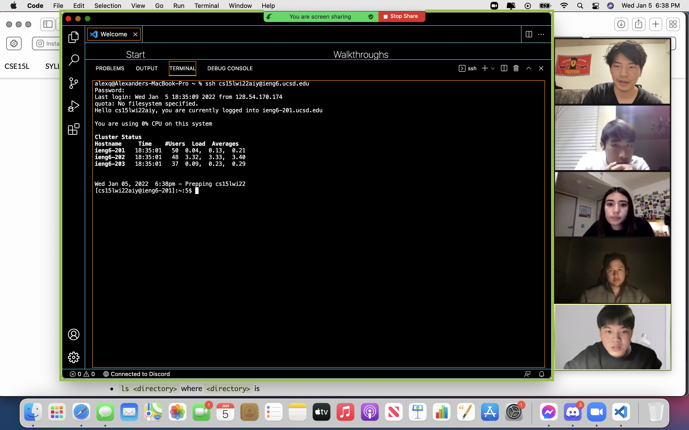
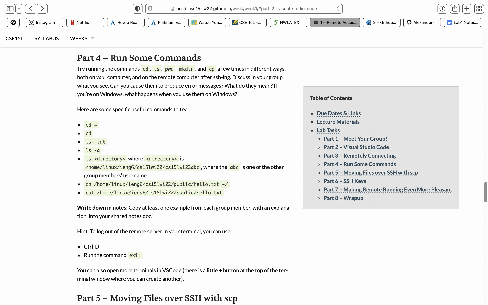
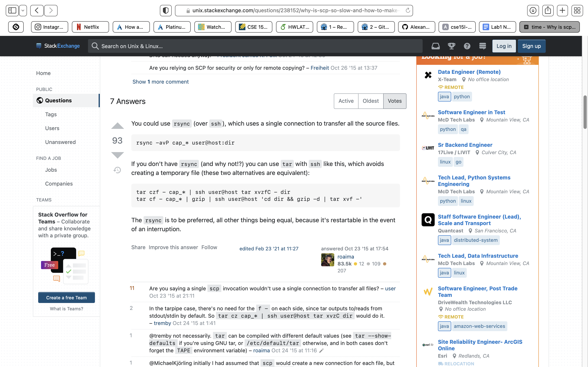

1.Installing VScode\
===
To install VScode Go to [https://code.visualstudio.com](https://code.visualstudio.com) 
Once it opens it should display\

 
2.Remotely Connecting\
For many jobs and professions in the CS field you will have to connect to a external server.\
The first thing you need to accomplish is to look up your course specific account at [https://sdacs.ucsd.edu/~icc/index.php](https://sdacs.ucsd.edu/~icc/index.php)\
After that you will move into your vsCode and then proceed to use the terminal for next few steps\
Using the

$ ssh cs15lwi22zz@ieng6.ucsd.edu\
where zz is replaced by your account id, type yes to respond and begin inputting your password.\
**Your password will not appear as you type\
This is what it should end up looking like.

 
3.Trying Some Commands\
There are many useful commands, use this sheet below and try some yourself!

 
4.Moving files with SCP\
One of the main actions you will be doing is moving and saving files from your main computer to the server\
You will run this command\
scp [fileName]] [userName]\
You will be prompted for a password\

 
5.Setting an SSH Key\
However you will begin noticing that to troubleshoot will take forever. Mostly because putting in a password everytime can get annoying. This is why we can set up a SSH key shortcut.\
Use the ssh-keygen command to create your passphrase and then mkdir the passphrase file generated into your server directory after signing back in. Once that is done you can now sign in via passphrase as shown below!

 
6.Optimize Remote Running\
Finally lets optimize our running, although the SSH key helps, it is important to keep speeding up our efficiency. Although SCP is a good method rsync is much faster as explained below!

 
For More information head to our class github link!

[https://ucsd-cse15l-w22.github.io/week/week1/#part-2--visual-studio-code](https://ucsd-cse15l-w22.github.io/week/week1/#part-2--visual-studio-code)

