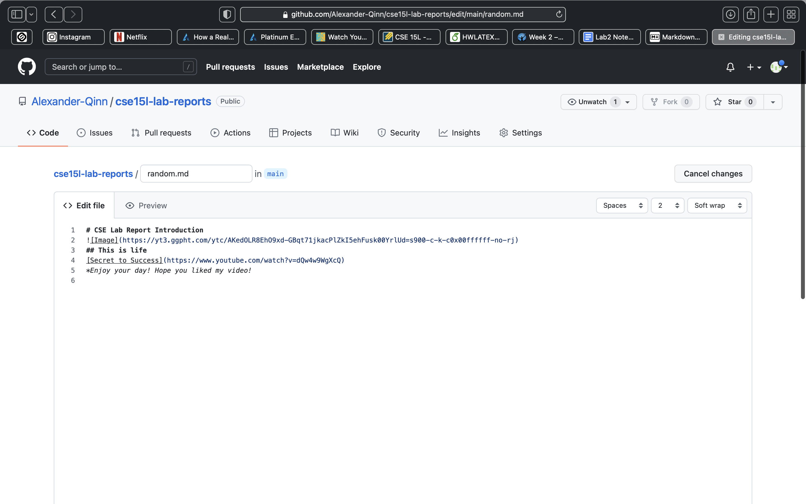
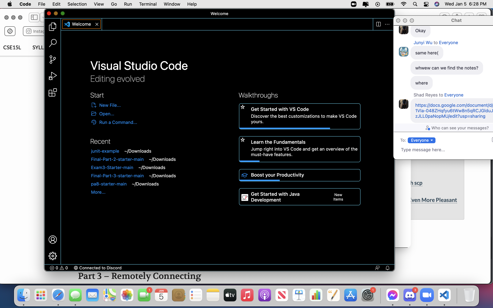
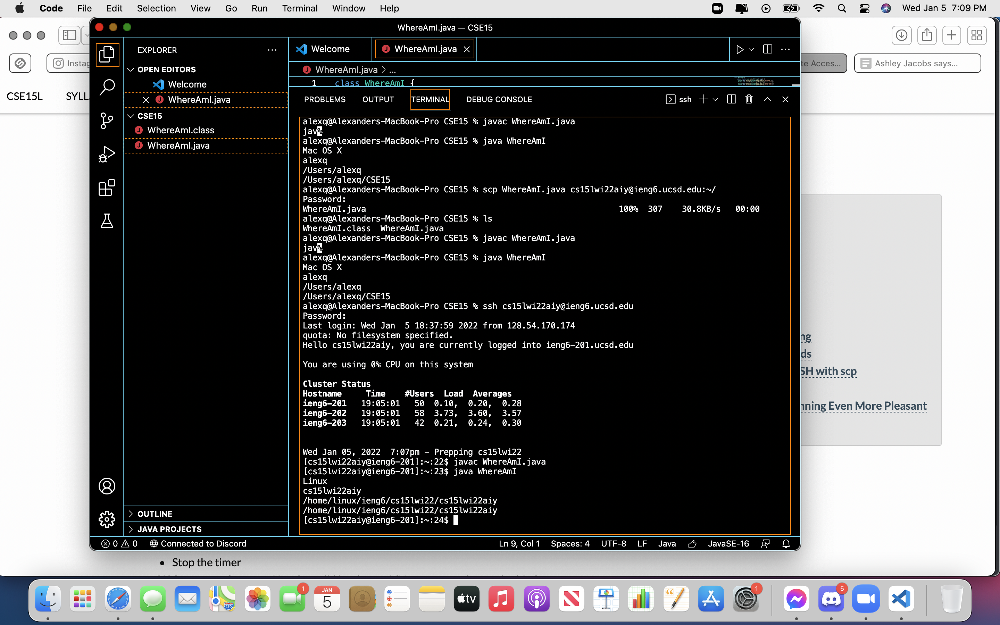

1. Installing VScode\
&nbsp;&nbsp;&nbsp;&nbsp;&nbsp;&nbsp;To install VScode Go to [https://code.visualstudio.com](https://code.visualstudio.com) 
Once it opens it should display\

 
2. Remotely Connecting
&nbsp;&nbsp;&nbsp;&nbsp;&nbsp;&nbsp;For many jobs and professions in the CS field you will have to connect to a external server.\
The first thing you need to accomplish is to look up your course specific account at [https://sdacs.ucsd.edu/~icc/index.php](https://sdacs.ucsd.edu/~icc/index.php)\
After that you will move into your vsCode and then proceed to use the terminal for next few steps\
Using the\ 
$ ssh cs15lwi22zz@ieng6.ucsd.edu\
where zz is replaced by your account id, type yes to respond and begin inputting your password.\
**Your password will not appear as you type\
This is what it should end up looking like.

 
3.Trying Some Commands
 
4.Moving files with SCP
 
5.Setting an SSH Key
 
6.Optimize Remote Running
 

