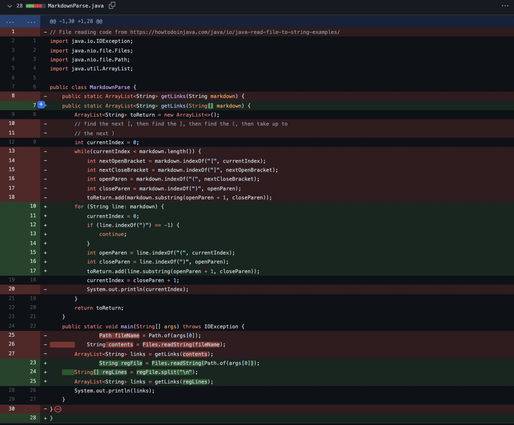
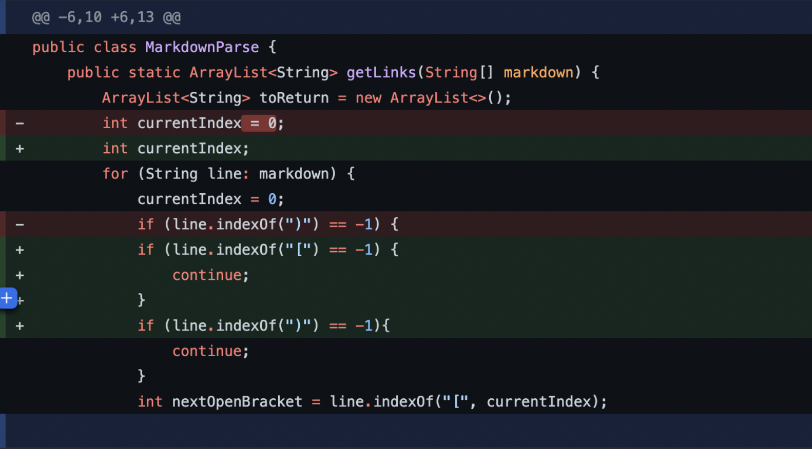
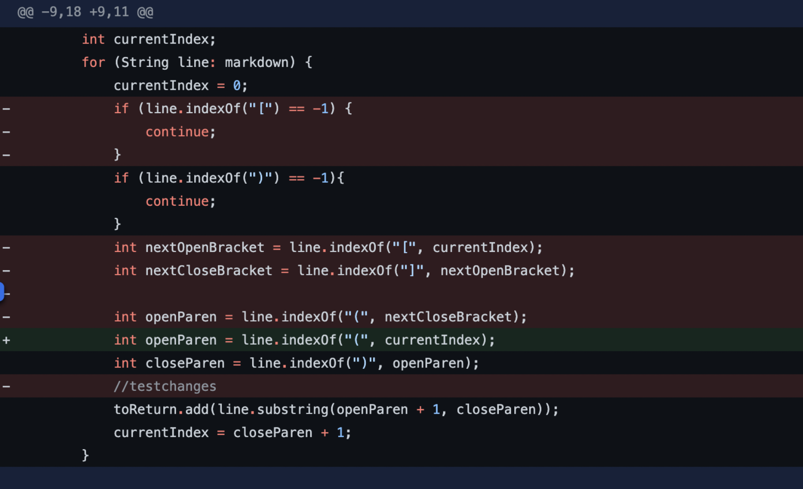

# 1. Code Change 1

## Dealing with open parenthesis

\
Test File: [First Test](https://github.com/Alexander-Qinn/cse15l-lab-reports/blob/main/test-file1.md)

Symptom:

```Exception in thread "main" java.lang.OutOfMemoryError: Java heap space
        at java.base/java.lang.StringLatin1.newString(StringLatin1.java:769)
        at java.base/java.lang.String.substring(String.java:2709)
        at MarkdownParse.getLinks(MarkdownParse.java:18)
        at MarkdownParse.main(MarkdownParse.java:27)```

# 2. Code Change 2

## Dealing with text after code

\
Test File: [Second Test](https://github.com/Alexander-Qinn/cse15l-lab-reports/blob/main/test-file2.md)

Symptom:

```Exception in thread "main" java.lang.StringIndexOutOfBoundsException: begin 0, end -1, length 27
        at java.base/java.lang.String.checkBoundsBeginEnd(String.java:4601)
        at java.base/java.lang.String.substring(String.java:2704)
        at MarkdownParse.getLinks(MarkdownParse.java:18)
        at MarkdownParse.main(MarkdownParse.java:27)```

# 3. Code Change 3

## Dealing with an empty Link

\
Test File: [Third Test](https://github.com/Alexander-Qinn/cse15l-lab-reports/blob/main/test-file3.md)

Symptom:

```alexq@Alexanders-MacBook-Pro cse15l-lab-reports % java MarkdownParse test-file3.md
39
[page.com]```