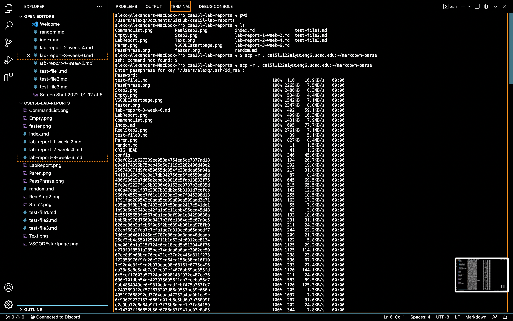
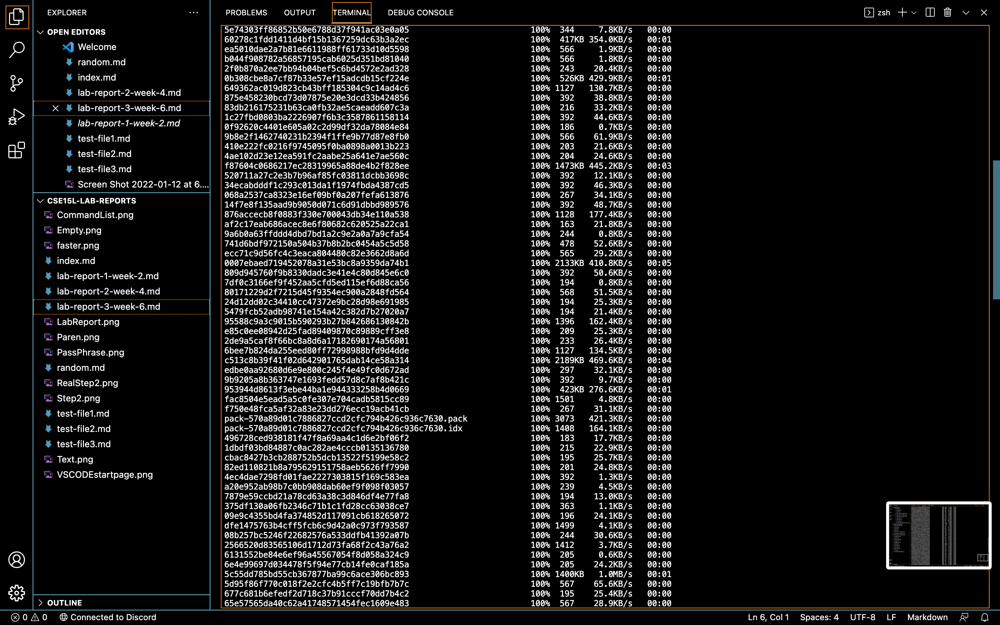
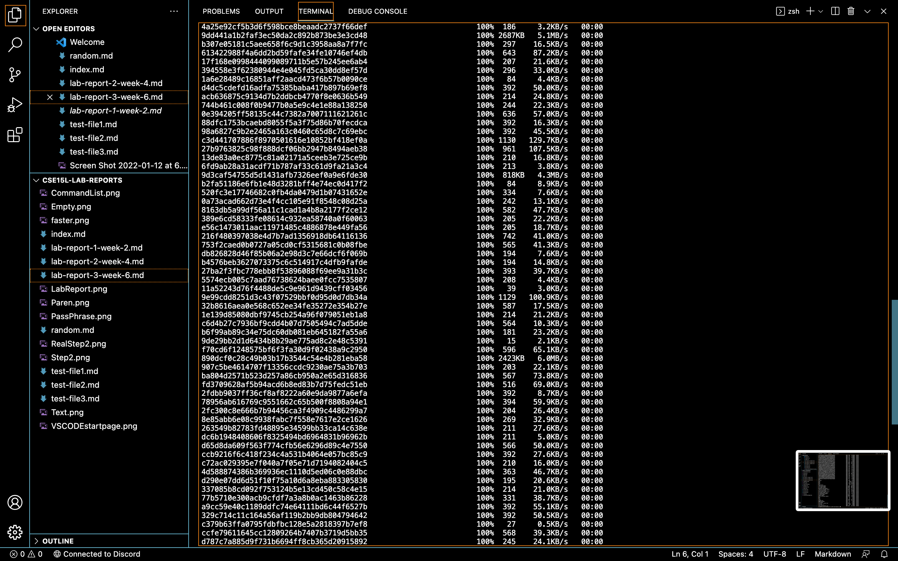
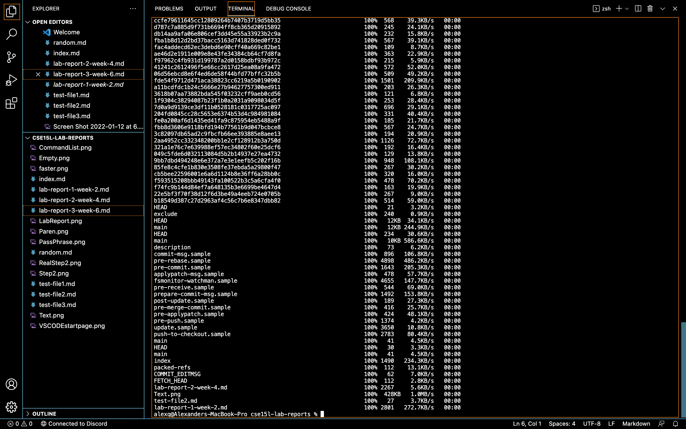

# CSE 15L Week 6 Lab Report 3

# Copy whole directories with `scp -r`

## 1. Show copying your whole markdown-parse directory to your ieng6 account

\
\
\
\

## 2. Show logging into your ieng6 account after doing this and compiling and running the tests for your repository

## 3. Show (like in the last step of the first lab) combining scp, ;, and ssh to copy the whole directory and run the tests in one line.