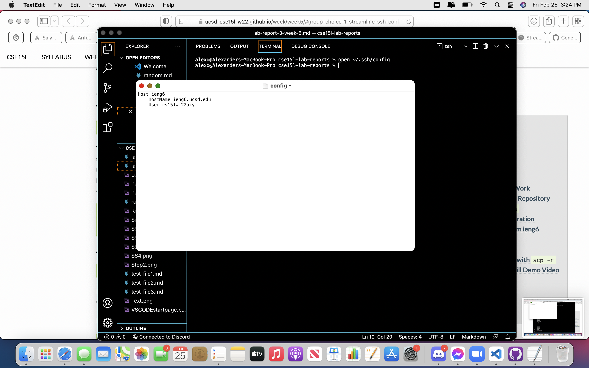
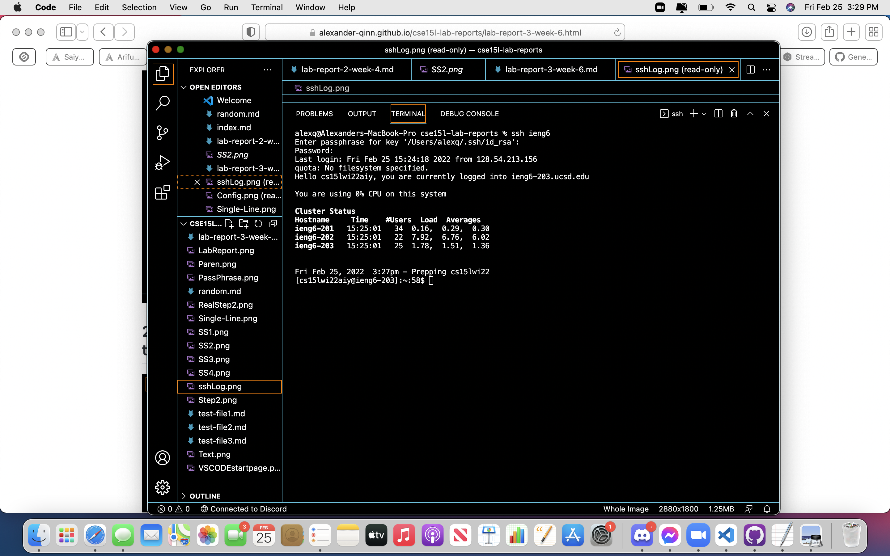
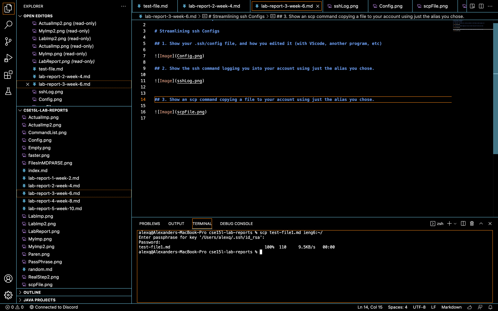

# CSE 15L Week 6 Lab Report 3

# Streamlining ssh Configs

## 1. Show your .ssh/config file, and how you edited it (with VScode, another program, etc)

## 2. Show the ssh command logging you into your account using just the alias you chose.

## 3. Show an scp command copying a file to your account using just the alias you chose.

