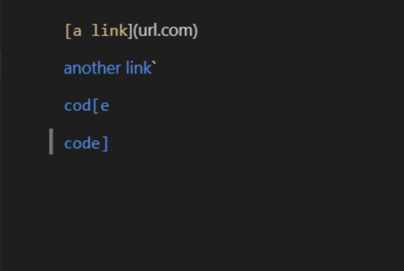
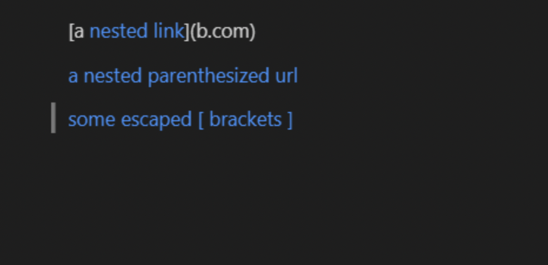
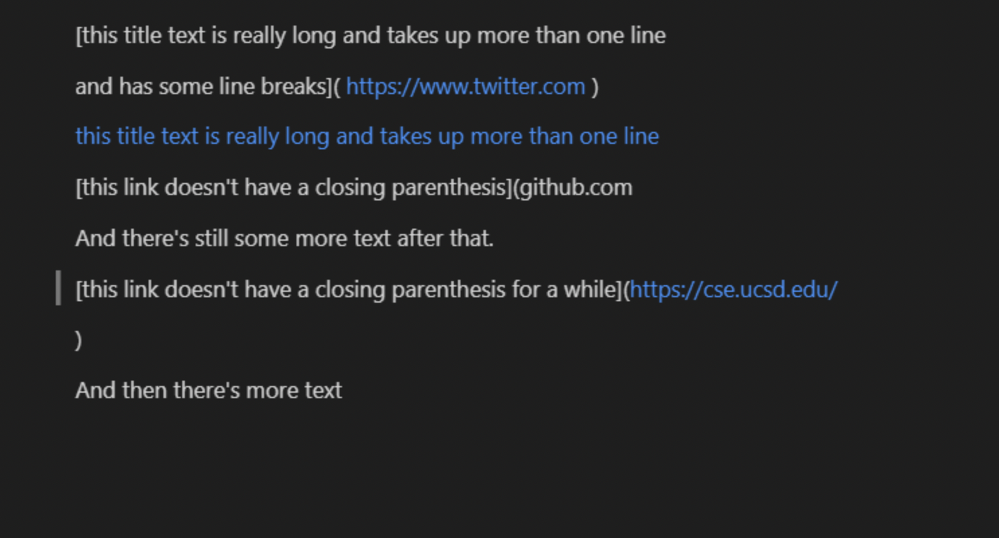

# Lab Report 4 - Week 8: Testing Snippets


## Link to MarkdownParse

[My MarkdownParse](https://github.com/Alexander-Qinn/markdown-parse.git)

[Reviewed MarkdownParse](https://github.com/Alexander-Kourjanski/markdown-parse.git)

# Snippet 1: 



Test file should be printing the links

### My Test:
```
@Test
    public void testSnippet1() throws IOException {
        String regFile = Files.readString(Path.of("./snippet-1.md"));
        String[] regLines = regFile.split("\n");
        assertEquals(List.of("`google.com", "google.com", "ucsd.edu"), MarkdownParse.getLinks(regLines));
    }
```

### Their Test:
```
@Test
    public void testSnippet1() throws IOException {
        ArrayList<String> Image = new ArrayList<>();
        Image.add("`google.com");
        Image.add("google.com");
        Image.add("ucsd.edu");
        String ImageTest = MarkdownParse.converter("snippet-1.md");
        assertEquals(Image, MarkdownParse.getLinks(ImageTest));
    }
```

## CompileTime/RunTime 

The test fails with my MarkdownParse producing error message:
```
testSnippet1(MarkdownParseTest)
java.lang.AssertionError: expected:<[`google.com, google.com, ucsd.edu]> but was:<[url.com, `google.com, google.com, ucsd.edu]>
        at org.junit.Assert.fail(Assert.java:89)
        at org.junit.Assert.failNotEquals(Assert.java:835)
        at org.junit.Assert.assertEquals(Assert.java:120)
        at org.junit.Assert.assertEquals(Assert.java:146)
        at MarkdownParseTest.testSnippet1(MarkdownParseTest.java:66)

FAILURES!!!
```
My parser includes url.com as a link when it shouldn't be one


Their code also fails the first test: 
```
testSnippet1(MarkdownParseTest)
java.lang.AssertionError: expected:<[`google.com, google.com, ucsd.edu]> but was:<[`google.com, google.com]>
        at org.junit.Assert.fail(Assert.java:89)
        at org.junit.Assert.failNotEquals(Assert.java:835)
        at org.junit.Assert.assertEquals(Assert.java:120)
        at org.junit.Assert.assertEquals(Assert.java:146)
        at MarkdownParseTest.testSnippet1(MarkdownParseTest.java:66)

FAILURES!!!
```
They failed to include the ucsd.edu link due to the second bracket which made their code consider it empty instead of holding a link.

# Snippet 2: 



Links will read between brackets producing 3 separate links

### My Test:
```
@Test
    public void testSnippet2() throws IOException {
        String regFile = Files.readString(Path.of("./snippet-2.md"));
        String[] regLines = regFile.split("\n");
        assertEquals(List.of("a.com", "a.com(())", "example.com"), MarkdownParse.getLinks(regLines));
    }
```

### Their Test:
```
@Test
    public void testSnippet2() throws IOException {
        ArrayList<String> Image = new ArrayList<>();
        Image.add("a.com");
        Image.add("a.com(())");
        Image.add("exampe.com");
        String ImageTest = MarkdownParse.converter("snippet-2.md");
        assertEquals(Image, MarkdownParse.getLinks(ImageTest));
    }
```

## CompileTime/RunTime 

My test fails due to not reading the last parenthesis on line 2:
```
testSnippet2(MarkdownParseTest)
java.lang.AssertionError: expected:<[a.com, a.com(()), exampe.com]> but was:<[a.com, a.com((]>
        at org.junit.Assert.fail(Assert.java:89)
        at org.junit.Assert.failNotEquals(Assert.java:835)
        at org.junit.Assert.assertEquals(Assert.java:120)
        at org.junit.Assert.assertEquals(Assert.java:146)
        at MarkdownParseTest.testSnippet2(MarkdownParseTest.java:65)

FAILURES!!!
```

Their code both printed the wrong link in line 2 as well as
didn't read the last link in the snippet: 
```
testSnippet2(MarkdownParseTest)
java.lang.AssertionError: expected:<[a.com, a.com(()), exampe.com]> but was:<[a.com, a.com((]>
        at org.junit.Assert.fail(Assert.java:89)
        at org.junit.Assert.failNotEquals(Assert.java:835)
        at org.junit.Assert.assertEquals(Assert.java:120)
        at org.junit.Assert.assertEquals(Assert.java:146)
        at MarkdownParseTest.testSnippet2(MarkdownParseTest.java:65)

FAILURES!!!
```

# Snippet 3: 



links will be read within brackets and produce 3 different links.

### My Test:
```
@Test
    public void testSnippet3() throws IOException {
        String regFile = Files.readString(Path.of("./snippet-3.md"));
        String[] regLines = regFile.split("\n");
        assertEquals(List.of("https://www.twitter.com", "https://ucsd-cse15l-w22.github.io/", 
            "https://cse.ucsd.edu/"), MarkdownParse.getLinks(regLines));
    }
```

### Their Test:
```
@Test
    public void testSnippet3() throws IOException {
        ArrayList<String> Image = new ArrayList<>();
        Image.add("https://www.twitter.com");
        Image.add("https://ucsd-cse15l-w22.github.io/");
        Image.add("https://cse.ucsd.edu/");
        String ImageTest = MarkdownParse.converter("snippet-3.md");
        assertEquals(Image, MarkdownParse.getLinks(ImageTest));
    }
```

## CompileTime/RunTime 

My code fails to read any links provided:
```
testSnippet3(MarkdownParseTest)
java.lang.AssertionError: expected:<[https://www.twitter.com, https://ucsd-cse15l-w22.github.io/, https://cse.ucsd.edu/]> but was:<[, , ]>       
        at org.junit.Assert.fail(Assert.java:89)
        at org.junit.Assert.failNotEquals(Assert.java:835)
        at org.junit.Assert.assertEquals(Assert.java:120)
        at org.junit.Assert.assertEquals(Assert.java:146)
        at MarkdownParseTest.testSnippet3(MarkdownParseTest.java:21)

FAILURES!!!
```

Their code fails due to printing all breaks and lines between links:
```
testSnippet3(MarkdownParseTest)
java.lang.AssertionError: expected:<[https://www.twitter.com, https://ucsd-cse15l-w22.github.io/, https://cse.ucsd.edu/]> but was:<[
    https://www.twitter.com
,
    https://ucsd-cse15l-w22.github.io/
, github.com

And there's still some more text after that.

[this link doesn't have a closing parenthesis for a while](https://cse.ucsd.edu/


]>
        at org.junit.Assert.fail(Assert.java:89)
        at org.junit.Assert.failNotEquals(Assert.java:835)
        at org.junit.Assert.assertEquals(Assert.java:120)
        at org.junit.Assert.assertEquals(Assert.java:146)
        at MarkdownParseTest.testSnippet3(MarkdownParseTest.java:65)

FAILURES!!!
```

---
## Q1

**Do you think there is a small (<10 lines) code change that will make your program work for snippet 1 and all related cases that use inline code with backticks? If yes, describe the code change. If not, describe why it would be a more involved change.**

The issue in snippet 1 is simply that it doesn't really check the formatting of the brackets that check if the file is a link or not. I guess the easiest way to fix it would be to add an if statement to check the formatting of the brackets and then using the find link method. If that doesn't work for some reason then it would definitely be a more involved change.

## Q2

**Do you think there is a small (<10 lines) code change that will make your program work for snippet 2 and all related cases that nest parentheses, brackets, and escaped brackets? If yes, describe the code change. If not, describe why it would be a more involved change.**

Snippet 2 basically failed our code through a extreme amount of parentheses, but the easiest fix would simply to write a code that looks for the specific pair of parenthesis, or ignore the initial ones outright.

## Q3

**Do you think there is a small (<10 lines) code change that will make your program work for snippet 3 and all related cases that have newlines in brackets and parentheses? If yes, describe the code change. If not, describe why it would be a more involved change.**

Snippet 3 I don't think has a good fix, my parser is built around a line by line detection, so it simply would not effectively read the url in that case. Extra spaces would just make it a different array instance and thus fail the code. A major change that could fix it would probably build the parser with a char by char reader or string by string. Maybe using a buffered reader instead of just a Scanner.
