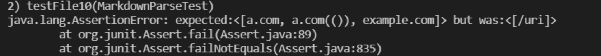
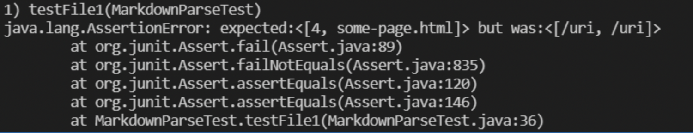
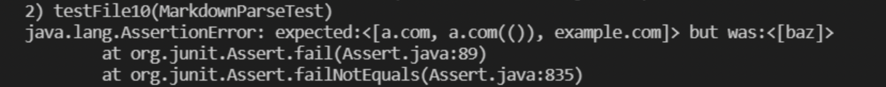
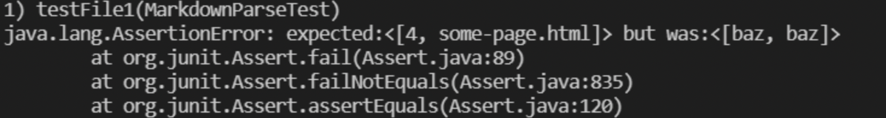

# Lab Report 5 - Week 10: Tests and more Tests

## Test # 1

* I manually searched and saw that my implementation and the lab's implementation differed.

* I ran through tests in the md file and recognized this test was different with two implementations

* Tests are file 518 or test 518.html

### My implementation

### Lab implementation

### Actual output

* According to the outputs, my implementation seems to be the most correct

* The main issue seems to be the repetition of /uri which definitely points to possibly a looping error in which there is an extra iteration. With the test having lots of parenthesis, findCloseParen() definitely could be flawed, I might also wanna look at the GetLinks method in order to be consistent with the lab to prevent possible error.

## Test # 2

* I manually searched and saw that my implementation and the lab's implementation differed.

* I ran through tests in the md file and recognized this test was different with two implementations

* Tests are file 518 or test 518.html

### My implementation

### Lab implementation

### Actual output

* According to the outputs, my implementation seems to be the most correct

* Similarly to the last test, the issue in the code seems to be the loops in my code create too many outputs. Definitely might have too many loops or unnecesary ones in the GetLinks and findCloseParen methods. Again very similar reasoning to the previous Test.